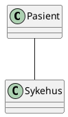

Før du kan løse må du forstå.
Da må du gjøre en analyse
Object Oriented Analysis/Design
OOA, OOD, OOA, OOAD.
Analyse er å forstå. Design å løse.
Ikke trekke inn løsning i problemet.

## Object Oriented analysis
- Modelling real world objects based on their description
- produce object analysis modelling
- pays primary attention to the objects with which the problem is concerned.
- Ignore other objects.
Specification is the "drawing" which is the base of the program.

*Hvorfor har vi OOP*
- Modellere den virkelige verden
	- Statiske strukturen
		- Hvordan ting henger sammen
		- En pasient tilhører ett sykehus
	- Dynamiske strukturen
		- Kan en pasient være pasient på to sykehus samtidig
		- Forflyttelse
- Er det poeng å snakke om pasient hvis man ikke gjør det i kontekst av et sykehus?
- Forstå domenet. kan ikke designe universitet som et sykehus med mange små rom.

- En relasjon mellom en pasient og et sykehus.
- Abstraksjonsnivå, Level of granularity

Klikker nivå
USB, HHE nivå.
IR.
OSV.

Abstraction gjør at vi kan lage overordnede prinsipper.

# Hvordan
Vi bruker OOA.
+ Finne Klasser
+ Beskrive relasjoner mellom klasser
+ Beskrive ansvarsområdene til hver klasse
+ Entity klasser lærer vi.

Klasser
- Entitet
	- tenk databasetabell
- Kontrollerklasser

Tasklist
1. Obtain or prepare a textual desscription
2. Underline the nouns
3. Organize the nouns into groups to become candidate classes.
4. Underline all the adjectives
5. Assign the adjectives as attributes ot the candidate classes
6. Underline the verb, differentiate action from stative verb.
7. Assign the action verbs to operation of classes.
8. Assign the stative verbs as attributes of classes or relationship.

Proper noun - Object instantiation - alice
Common noun - class Customer
Doing verb - Association - creates, drives, submits
being verb - special form, inheritence, specialization - is kind of 
Havin/owrning verb - aggregation, composition, has, includes
adjective  - atrtributes.

