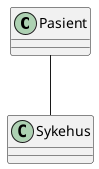

Før du kan løse må du forstå.
Da må du gjøre en analyse
Object Oriented Analysis/Design
OOA, OOD, OOA, OOAD.
Analyse er å forstå. Design å løse.
Ikke trekke inn løsning i problemet.

## Object Oriented analysis
- Modelling real world objects based on their description
- produce object analysis modelling
- pays primary attention to the objects with which the problem is concerned.
- Ignore other objects.
Specification is the "drawing" which is the base of the program.

*Hvorfor har vi OOP*
- Modellere den virkelige verden
	- Statiske strukturen
		- Hvordan ting henger sammen
		- En pasient tilhører ett sykehus
	- Dynamiske strukturen
		- Kan en pasient være pasient på to sykehus samtidig
		- Forflyttelse
- Er det poeng å snakke om pasient hvis man ikke gjør det i kontekst av et sykehus?
- Forstå domenet. kan ikke designe universitet som et sykehus med mange små rom.

- En relasjon mellom en pasient og et sykehus.
- Abstraksjonsnivå,

