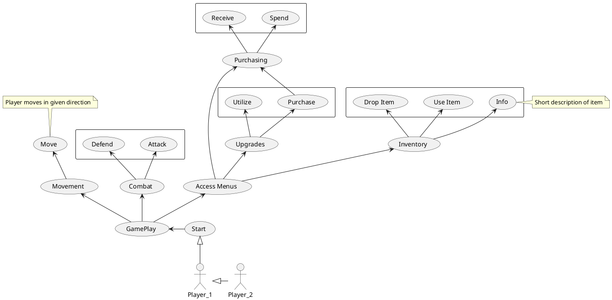

DBA
B+ 
Strukturere en indeks på
Node på toppen
Tre piler ned, A til E, F til T, U til Z.
dynamisk til hvor mye informasjon
Hver node peker til hver enkel verdi i databasen
binary search

```plantuml
@startuml
skinparam packageStyle rect
(Start) <|-- :Player_1:
Player_1 <|-right- :Player_2:

(GamePlay) <-right-(Start)
(Movement) <-- (GamePlay)
(Move) <-- (Movement)
Note top of (Move): Player moves in given direction

(Combat) <-- (GamePlay)
Rectangle {
  (Attack) <-- Combat
  (Defend) <-- Combat
}

usecase (Access Menus) as Menus 
Menus <-- (GamePlay)

(Upgrades) <-- Menus
Rectangle {
  (Purchase) <-- Upgrades
  (Utilize) <-- Upgrades 
}

(Inventory) <-- Menus
Rectangle {
  (Use Item) <-- Inventory
  (Drop Item) <-- Inventory
  (Info) <-- Inventory
}
Note right of Info: Short description of item

(Purchasing) <-- Menus
Rectangle {
  (Spend) <-- (Purchasing)
  (Receive) <-- (Purchasing)
}

(Purchasing) <-- Purchase


@enduml
```
