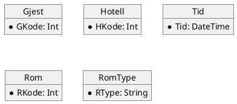
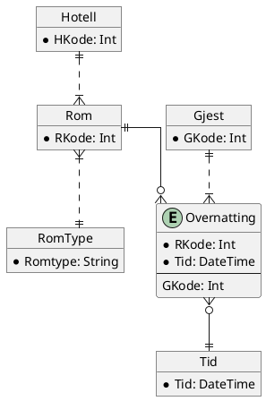
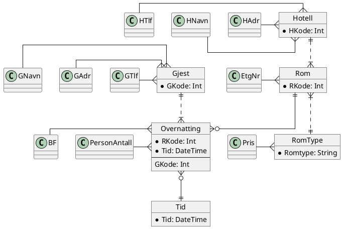

```table-of-contents
```
# Forrige gang
## Viktigste tingene i modellering
- Objekter må ha være unikt identifiserende. Attributter og objekter sammen lager entiteter. 
- Start først med å finne objektene i oppgaveteksten.
- Deretter se på relasjonene (da kan du finne fremmednøkler, om du trenger koblingstabeller osv.)
- Begynne med tid og sted.
## Oppgaven
### Objekter i oppgaven

### Modell

### Modell med attributter

Object nivå: Objekter som rundinger, attributter, kobler med relasjoner.
### Entitets-nivå:
```plantuml
skinparam linetype ortho
entity Hotell{
*HKode
--
HNavn
HAdr
HTlf
}

entity Rom{
*RKode
--
EtasjeNr
}

entity RomType{
*RT
--
Pris
}
entity Tid{
*Tid
}
entity Overnatting{
*Tid
*RKode
--
AntPers
BF
}

entity Gjest{
*GKode
--
GNavn
GAdr
GTlf
}

Hotell||-|{Rom
Rom}|-||RomType
Gjest|o--|{Overnatting
Overnatting}o-||Tid
Rom||-o{Overnatting
```
MySql-Entitetsnivå:
Legge inn Fremmednøkler.
Hvorfor ha tid. Smart å føre opp som entitet, for å huske at den skal være med.