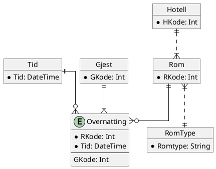

```table-of-contents
```
# Forrige gang
## Viktigste tingene i modellering
- Objekter må ha være unikt identifiserende. Attributter og objekter sammen lager entiteter. 
- Start først med å finne objektene i oppgaveteksten.
- Deretter se på relasjonene (da kan du finne fremmednøkler, om du trenger koblingstabeller osv.)
- Begynne med tid og sted.
## Oppgaven
### Objekter i oppgaven

### Modell

