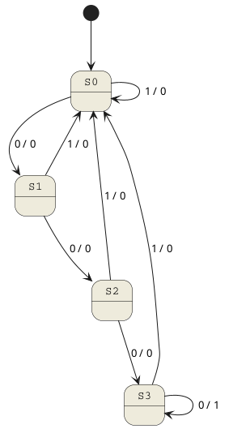

```plantuml
@startuml
skinparam state {
  BackgroundColor #EEEBDC
  BorderColor black
  FontName Courier
}

[*] --> S0

state S0 {
}

state S1 {
}

state S2 {
}

state S3 {
}

S0 --> S1 : 0 / 0
S0 --> S0 : 1 / 0

S1 --> S2 : 0 / 0
S1 --> S0 : 1 / 0

S2 --> S3 : 0 / 0
S2 --> S0 : 1 / 0

S3 --> S3 : 0 / 1
S3 --> S0 : 1 / 0

@enduml

```
